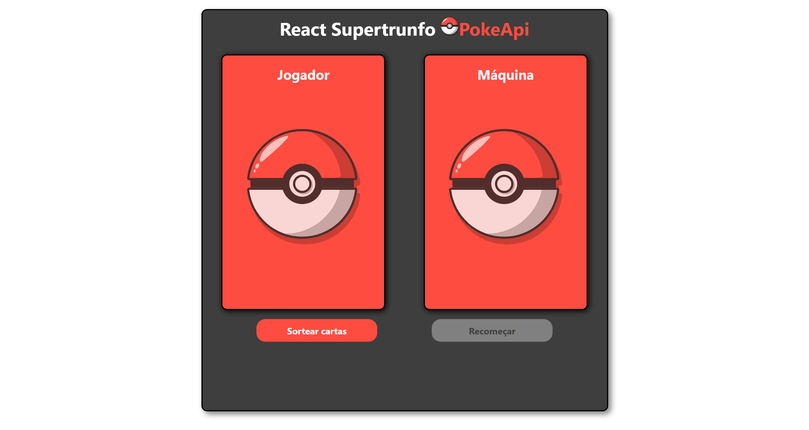
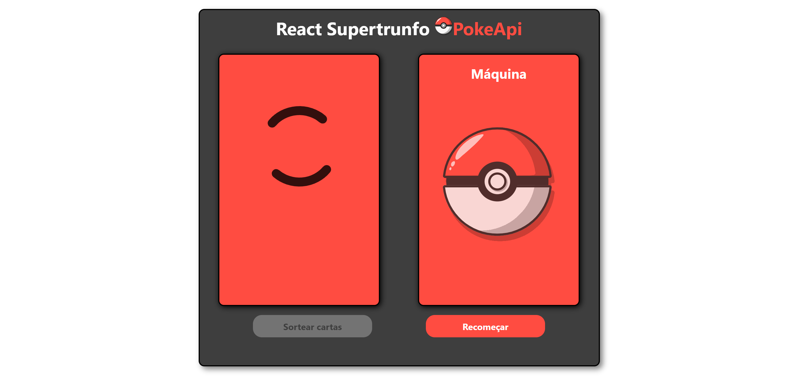
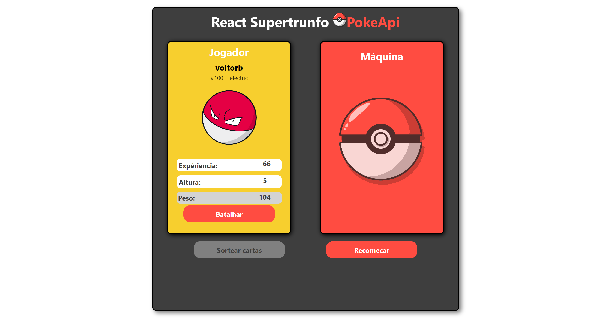
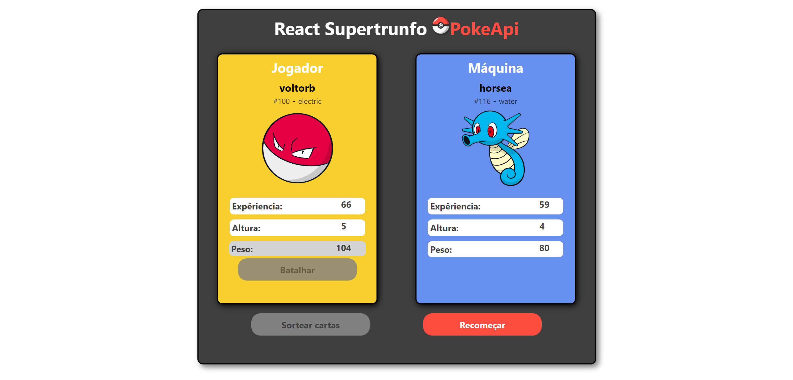

# SUPER TRUNFO POKEAPI
*(Ainda em desenvolvimento e evolução)*

Este é o meu primeiro projeto desenvolvido do zero com React e Api.

Desde o meu primeiro contato com JavaScript em uma Imersão Alura, onde com um array fizemos um super trunfo simples, e então em um bootcamp da DIO tive o primeiro contato com a [PokeApi](https://pokeapi.co/). Assim poderia construir o meu próprio com os conhecimentos adquiridos.

**No momento estou estudando REACT, então escolhi fazer um SuperTrunfo com React utilizando a [PokeApi](https://pokeapi.co/)**

#### Iniciando

O jogador clicando em **sortear cartas** aguarda o sorteio para escolher dentre as opções disponíveis

E então clicando em **batalhar** podemos conferir o resultado com a carta da Máquina

<!---
https://pokeapi.co/api/v2/pokemon/{id or name}/

https://pokeapi.co/api/v2/pokemon/
-->
